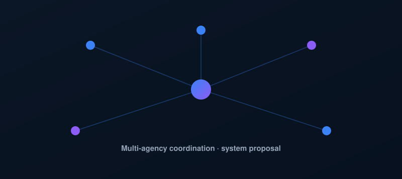

  

  📧&nbsp;<a href="mailto:kwebbelkop62@gmail.com">kwebbelkop62@gmail.com</a>
  &nbsp;·&nbsp; 📍&nbsp;Penang, Malaysia
  &nbsp;·&nbsp; 🔗&nbsp;Open to junior developer roles

 

<table align="center">
<tr>
<td align="center" width="16%">

</td>
<td align="center" width="16%">

</td>
<td align="center" width="16%">

</td>
</tr>
</table>

<blockquote align="center">
<b>Always building, always learning.</b> 
From ideas to impact — one commit at a time.
</blockquote>

## 👨‍💻 About Me

- 🎓 Software Engineering (Hons) student at Wawasan Open University (WOU DiGiT), Penang
- 🏥 Currently building **CareHub** — a full-stack patient/caregiver appointment tracker with Next.js, Supabase, PostgreSQL, and role-based access
- 🧠 Led **SENTINEL** — an evidence-grounded AI system proposal for multi-agency emergency coordination in Malaysia (URIIS Student Business Innovation Challenge 2026)
- 🌱 Deepening: systems analysis & design, computer architecture, digital commerce
- 💼 3 years of prior experience in retail sales, trading operations, and small business ownership before pivoting into software engineering

📧 [kwebbelkop62@gmail.com](mailto:kwebbelkop62@gmail.com) &nbsp;·&nbsp; 🔗 [Let's connect →](https://github.com/kwebbelkop62-glitch)

## 🚀 Featured Projects

<table>
<tr>
<td width="50%" valign="top">

**[CareHub](https://github.com/kwebbelkop62-glitch/carehub)**

A full-stack patient and caregiver appointment tracker with role-based access, Postgres row-level security, and scheduled email reminders.

`Next.js` `TypeScript` `Supabase` `PostgreSQL`

[Live Demo →](https://carehub-theta.vercel.app)

</td>
<td width="50%" valign="top">

**SENTINEL**

An evidence-grounded AI system proposal for multi-agency emergency coordination in Malaysia — a two-model architecture with defined human-approval boundaries. URIIS Student Business Innovation Challenge 2026.

`System Design` `AI Architecture` `Research Proposal`

Private repo — proposal and pitch deck available on request.

</td>
</tr>
</table>

## 🧰 Tech Stack

<table align="center">
<tr>
<td align="center" width="11%"> React</td>
<td align="center" width="11%"> Next.js</td>
<td align="center" width="11%"> TypeScript</td>
<td align="center" width="11%"> Node.js</td>
<td align="center" width="11%"> PostgreSQL</td>
<td align="center" width="11%"> Supabase</td>
<td align="center" width="11%"> Tailwind</td>
<td align="center" width="11%"> Git</td>
</tr>
</table>

## 📊 Contribution Activity

  

  

---

Let's build something great together. 🚀

  
  &nbsp;&nbsp;
  

