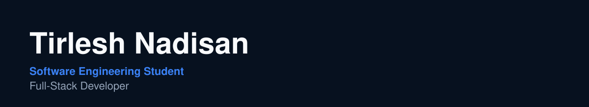
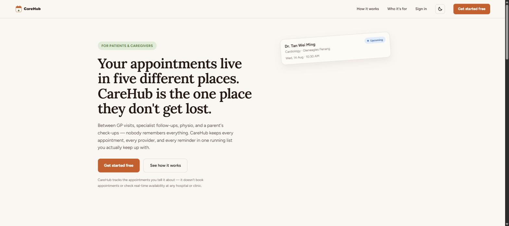
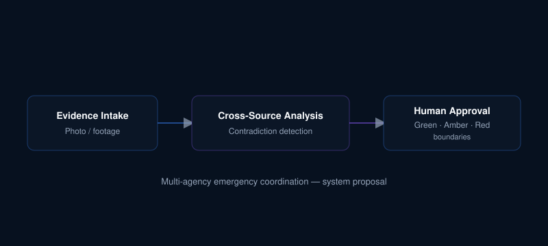

  

I build practical full-stack applications with a focus on clean architecture, real-world problems, and thoughtful user experiences.

`TypeScript` · `React` · `Next.js` · `Node.js` · `PostgreSQL`

Malaysia · Open to junior developer opportunities · [kwebbelkop62@gmail.com](mailto:kwebbelkop62@gmail.com)

 

## About

I'm a Software Engineering student at Wawasan Open University in Penang, focused on full-stack development and systems design. I'm currently building practical applications while transitioning from a background in retail operations and small business into software engineering. My experience before software gives me a practical perspective on building technology for real people and real workflows.

## Selected Work

<table>
<tr>
<td width="60%" valign="top">

</td>
<td width="40%" valign="top">

**CareHub**

A full-stack patient and caregiver appointment platform designed around role-based access, scheduling, reminders, and real-world healthcare workflows.

`Next.js` `TypeScript` `Supabase` `PostgreSQL`

[Live Demo](https://carehub-theta.vercel.app) · [Repository](https://github.com/kwebbelkop62-glitch/carehub)

</td>
</tr>
<tr>
<td width="60%" valign="top">

</td>
<td width="40%" valign="top">

**SENTINEL**

An evidence-grounded AI system proposal for multi-agency emergency coordination in Malaysia, developed for the URIIS Student Business Innovation Challenge 2026.

`System Design` `AI Architecture` `Research Proposal`

Private repo — proposal and pitch deck available on request.

</td>
</tr>
</table>

## Technical Toolkit

**Frontend** — React · Next.js · TypeScript

**Backend & Data** — Node.js · PostgreSQL · Supabase

**Tools** — Git

## Currently

Building CareHub and strengthening my foundations in software architecture, databases, and full-stack application development.

## Contact

[GitHub](https://github.com/kwebbelkop62-glitch) · [Email](mailto:kwebbelkop62@gmail.com)

Open to junior software engineering and full-stack development opportunities.
